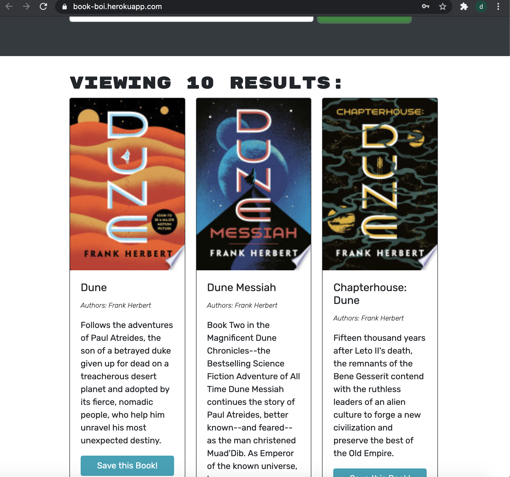

# probable-memory
 
  (https://opensource.org/licenses/MIT)

  

 ##  Description
 ### This Application uses graphql, react and googles search book api to create an app where users can create an account, search books and add and delete them from their personalized collection!
 ---
 ## Table of Contents
 - [Installation](#installation)
 -[License](#license)
 -[Tests](#tests)
 -[Questions](#questions)
 ---
 ## Installation
 ###### npm i
 
 
 ## License
 ###### This project is licensed under the terms of MIT
 ###### license.

 
 ## Tests
 ###### Run npm test to run tests.
 
 ## Questions
 ###### If you have any questions about this repo, contact https://github.com/drewvena/probable-memory
 
 ## Email
 ###### drewvena1@gmail.com